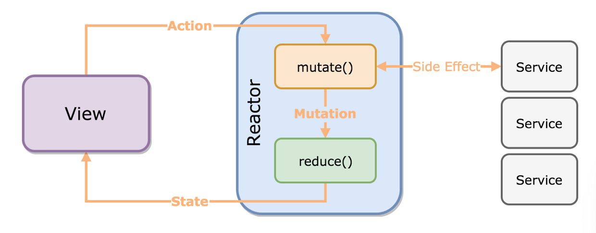
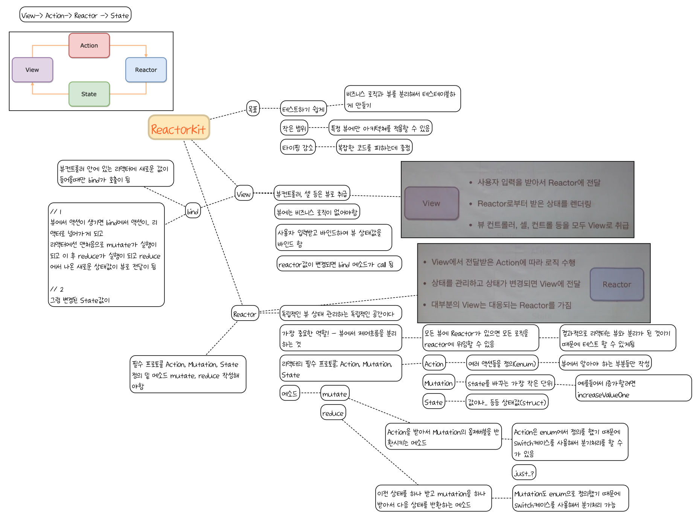

# ReactorKitPractice
ReactorKit 연습 프로젝트 입니다.

### ReactorKit이란?

**단방향 데이터 흐름**을 가진 **반응형** 앱을 위한 프레임워크 라네요..

단방향..?  뭔가 어렵죠..? 이를 알기 위해선 ReactorKit의 기본적인 데이터 흐름을 알 필요가 있어요. 이 부분은 조금있다가 설명해 보도록 할게요. 그럼

### ReactorKit은 왜 사용할까요?

ReactKit은 MVC 디자인 패턴중 컨트롤러 부분이 무거워지고, RxSwift와 다양한 디자인 패턴을 적용해보면서 상태관리가 어렵단 문제점을 발견하고 이를 해결하고자 만들었다고 해요. 그러니깐 이런 부분들을 해결할려고 사용하는거겠죠?

- **뷰와 비즈니스 로직이 분리**되어 MVVM패턴과 같이 뷰 컨트롤러가 가벼워지고 **테스트하기 좋아집니다.**
- RxSwift 기반으로 만든 것이기 때문에 **RxSwift의 모든 기능을 사용할 수 있고**
- 데이터가 **단방향 데이터 흐름**이기 때문에 데이터 흐름이 간결해지고, 중간상태를 reduce() 메소드로 관리하기 때문에 **상태관리가 간결해집니다.**

등등..의 이유로 사용을 하는 것 같습니다. 

### 단방향 데이터 흐름..?

ReactorKit의 기본적인 데이터 흐름을 사진으로 보자면


이렇게 생겼어요. ReactorKit에서 Reactor는 MVVM 디자인 패턴에서 ViewModel 과 같은 역할을 하고 있는데, 기존 ViewController에서 뷰를 제외한 비즈니스 로직부분을 Reactor에서 처리해주고 있어요. 간단한 flow를 보자면

1. View에서 Button과 같은 Action을 Reactor에 전달하여
2. Reactor에서 비즈니스 로직을 실행한 후 그에 따라 State값을 변경 후
3. View에서 Reactor의 State 상태값을 가져옴으로써 뷰의 상태를 변경합니다.

즉 View 에선 Reactor에게 Action만 줄 수 있고, Reactor는 View에게 State값만 줄 수 있는 단방향 데이터 흐름이라는 거죠.

> 뷰의 비즈니스 로직 부분이 Reactor로 빠진 것 뿐이지 View에서 액션을 받고 Reactor의 State값을 가져오는건 View에서 bind 메소드가 할 거에요.

```swift
// ViewController.swift
...
func bind(reactor: ViewReactor) {
        
        // action
        increaseButton.rx.tap
      			// Reactor에게 Action을 보내죠?
            .map{Reactor.Action.increase}
            .bind(to: reactor.action)
        .disposed(by: disposeBag)
        
        // State
      	// reactor의 State값을 가져오죠?
        reactor.state.map{$0.value}
        .distinctUntilChanged()
        .map{String($0)}
            .bind(to: valueLabel.rx.text)
        .disposed(by: disposeBag)
    }
```

그래서 ReactorKit은 크게 View와 Reactor 두개가 쌍으로 있다고 생각하시면 되요. 그럼 지금부터 ReactorKit에서 View와 Reactor에 대해 알아보기 전에 큰 틀을 한번 본 후에 알아보도록 할게요. .

### ReactorKit의 큰 틀

- View (View or Storyboard 프로토콜 채택)
  - UI
    - 프로퍼티 정의(UILabel과 같은)
    - Constraint 작성
  - bind(): 뷰컨트롤러 안에 있는 reactor값이 변경되면 호출
    - // action부분
    - // state 부분
- Reactor (Reactor 프토토콜 채택)
  - 3개의 정의
    - Action(enum): 여러 액션들을 정의
    - Mutation(enum): State값을 바꾸는 가장 작은 단위
    - State(struct): 값이나 상태값
  - 2개의 메소드
    - mutation(): Action을 받아서 Mutation의 옵져버블을 반환시키는 메소드
    - reduce(): 이전 상태, mutation값을 받아서 다음 상태를 반환하는 메소드

### View

ReactorKit에서의 View는 기본 ViewController에서 비즈니스 로직 부분이 빠진 부분을 말해요.  즉 UIButton과 Constraint 과 같은 뷰 부분과 reactor에게 action을 전달해주고 state값을 가져올 bind 메소드가 있어요.

- 뷰 (비즈니스 로직이 없어야 해요)
- bind 메소드
  - // action 보내기
  - // state 가져오기

> bind 메소드는 리액터에 새로운 값이 들어올 때에만 트리거 되요

추가로 View 부분은 ReactorKit에서 정의한 View 프로토콜을 추가로 채택해야 해요. 만약 스토리보드를 사용하신다면 StoryboardView를 채택해주시면 됩니다.


### Reactor

Reactor는 View의 비즈니스로직이 나온 부분입니다. 즉 View의 상태를 관리하는 독립적인 공간인거죠. 

> Reactor의 가장 중요한 역할: 뷰에서 제어흐름을 분리한다 -> 결과적으로 Reactor(로직)는 View와 분리가 됨으로써 Testable해짐



전체적인 흐름을 보자면 View에서 액션이 생기면 bind에서 액션이 리액터로 넘어가게 되고, 리액터에선 맨 처음으로 mutate가 실행되고 reduce에서 나온 새로운 상태값이 뷰로 전달되는 흐름의 로직입니다.

> View -> (Action을) -> Reactor로 전달
>
> Reactor -> (State값이 바뀌면 State값을) -> View로 전달

 Reactor 역시 Reactor 프로토콜을 채택해야 사용할 수 있습니다. Reactor 부분에선 3개의 정의, 2개의 메소드를 필수적으로 작성해주셔야 해요(Reactor 프로토콜)

- 3개의 정의
  - Action(enum): 여러 액션들을 정의
  - Mutation(enum): State값을 바꾸는 가장 작은 단위
  - State(struct): 값이나 상태값
- 2개의 메소드
  - mutation(): Action을 받아서 Mutation의 옵져버블을 반환시키는 메소드
  - reduce(): 이전 상태, mutation값을 받아서 다음 상태를 반환하는 메소드

```swift
// ViewReactor.swift
...
// 3개의 정의
		enum Action {
      // 여러 액션들을 정의
      case increase
      ...
    }
    
    enum Mutation {
      // State값을 바꾸는 가장 작은 단위
      case increaseValue
			...
    }
    
    struct State {
      // 값이나 상태값
			var value: Int = 0
      var isLoading: Bool = false
      ...
    }

	let initialState: State = State()

// 2개의 메소드
func mutate(action: Action) -> Observable<Mutation> {
        switch action {
					case .increase
          	return Observable.just(Mutation.increaseValue) ...
        }
    }
    
    func reduce(state: State, mutation: Mutation) -> State {
        var newState = state
        switch mutation {
        case .increaseValue:
            newState.value += 1
				...
        return newState
    }
```

정의 부분을 보면 아시겠지만 이름만 보면 로직을 작성해야 할 것 같지만.. enum과 struct이기 때문에 이부분에 실질적인 로직이 들어가진 않고 딱 정의만 해줍니다.

다음으로 두개의 메소드를 자세히 보면..

1. mutate(action: Action) -> Observable<Mutation>:

- Action 스트림을 Mutation 스트림으로 변환하는 역할

- View에서 bind 메소드에 의해 액션이 Reactor로 넘어가게 되면 맨 처음으로 mutate가 실행되는 메소드입니다. 

- 네트워킹이나 비동기 로직과 같은 로직을 이곳에서 처리 후에 그 결과값으로 옵져버블Mutation을 리턴하는데 이 값이 reduce() 메소드로 전달됩니다.

  > View의 bind()에서
  >
  > 1. Action -> Reactor[mutate() -> reduce()]

2. func reduce(state: State, mutation: Mutation) -> State

- 이전 상태값을 mutate()메소드에서 받은 mutation 값을 가지고 다음 상태값으로 변경하는 역할을 합니다.(변경 후 State값 return)

  > 변경된 상태값을 View의 bind()메소드를 통해 View에서 UIController과 같은 것들을 보여줄지 말지 등을 판단하여 보여줍니다.


### 참고자료

- [ReactorKit 라이브 영상](https://www.youtube.com/watch?v=ASwBnMJNUK4)
- [전수열님의 ReactorKit 미디엄 포스팅](https://medium.com/styleshare/reactorkit-시작하기-c7b52fbb131a)
- [Github - ReactorKit](https://github.com/ReactorKit/ReactorKit)
- [eungding님 블로그](https://eunjin3786.tistory.com/100)


### 마인드맵

